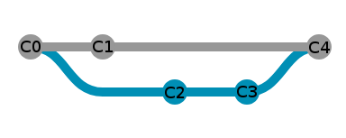
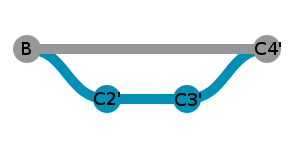

# ripit

**ripit** is an executable that automates the copy of commits between two
git repositories.
Its main purpose is to be able to publish a repository while being able to
control what is made public. For example:
* Only publish after a given commit, so that the previous history is kept
  private.
* Remove specific tags from commit messages (for example, tags
  referencing internal tickets).
* Redact author of commits to keep anonymity if desired (not yet developed).

The topology of the repository is kept as much as possible. In particular, merge
commits are properly copied if possible (see [uprooting](#Uprooting) for more details).

## Installation

**ripit** is written in rust and uses
[cargo](https://github.com/rust-lang/cargo "cargo"). To build it, simply do:

```console
$ cargo build --release
$ cargo install --path .
```

**ripit** requires rust 2018, so the version of _rust_ / _cargo_ should be
greater than 1.31.

## Use

**ripit** works inside a local repository (the public one), copying commits from
a remote (the private repository).

To use **ripit**, a configuration file must first be created. A complete template
is available in *config-template.yml*, here is an example:

```yaml
path: /path/to/the/local/repo
remote: private
branches:
  - v1
  - master
```

### Bootstrapping

Then, bootstrap commits must first be created, which will initialize the
local repository with a single commit, containing the state of the
_private/{branch}_ branch, for every branch to synchronize.

```console
$ mkdir /path/to/the/local/repo && cd /path/to/the/local/repo
$ git init
$ git remote add private <...>
$ ripit --bootstrap config.yml
Fetch branch v1 in remote private...
Fetch branch master in remote private...
Bootstrap commit 0573aafd79531c93c4149cc8a10dad54c800ca7a created for branch v1.
Bootstrap commit 06b6e5cb76a80250a033cade1eed7d38e84ab3e4 created for branch master.
```

### Synchronization
Then, running **ripit** will copy all new commits from the remote branches
into the local repository. This means that all commits from the private
repository that were committed before the bootstrap are hidden, and only
the new commits will be copied in the local repository.

```console
$ ripit config.yml
Fetch branch v1 in remote private...
Fetch branch master in remote private...
Found ripit tag, last synced commit was fe81a4739b7817304eb0fa1bf5719b05e324ba21.
Nothing to synchronize on branch v1, already up to date with private.
Commits to synchronize on master:
  Commit f1350c8c737c3d2a462956b73f8e5befd021321a
    Johnny Joestar <johnny.joestar@speedwagon.com>
    add new spin feature

  Commit 19fc6a5690d8c56ecbe26b45508a0f939dedbbf7
    Gyro Zeppeli <gyro.zeppeli@napoli.it>
    introduce mozarella easter egg

Is this ok? [yN] y
Copying commit f1350c8c737c3d2a462956b73f8e5befd021321a...
Created commit a03ccdee76289dd52c8f79442588084f0fcab9d6.
Copying commit 19fc6a5690d8c56ecbe26b45508a0f939dedbbf7...
Created commit 343178000ab4ee6d207787ccb44e79766689c0e1.
```

A prompt is displayed to allow checking whether the commits about to be
synchronized can be copied. Commits are not pushed automatically after
being synchronized, it is up to the caller to make sure the copies are valid,
and that the new commits can be pushed.

Every commit contains a **tag**, which is used to map copied commits with
the original ones:

```console
$ git show
commit 343178000ab4ee6d207787ccb44e79766689c0e1
Author: Gyro Zeppeli <gyro.zeppeli@napoli.it>
Date:   Fri Aug 16 14:11:36 2019 +0200

    introduce mozarella easter egg

    rip-it: 19fc6a5690d8c56ecbe26b45508a0f939dedbbf7
```

### Uprooting

In some cases, commits cannot be properly copied, and the synchronization
will be rejected. This can happen when trying to copy a merge commit that
brings commits with ancestors that predates the bootstrap. To handle this
situation, **ripit** allows cherry-picking those commits on top of the local
branch, a process called _uprooting_.



*Remote situation, bootstrap was done on C1*



*Local situation, commits C2 and C3 have been uprooted*

The topology of the repository is not preserved with this operation,
as those commits in the local repository will have different parents
than the original commits. This behavior is not activated by default to prevent
mistakes, as this situation can only happen if part of the remote repository
was hidden with the bootstrap. The `-u` flag must be used.

In addition, as the topology is not preserved, conflicts can happen when
copying those commits. In those cases, it is up to the user to resolve the
conflicts, and resume the synchronization.

## Limitations

* **ripit** is still in alpha stage. Complex topologies might break down, and copies
  must be impected by hand to make sure no private information are leaked. A stable
  release is planned in the near future.

_thanks to [GitGraphJs](https://gitgraphjs.com) for the git graph generation_
